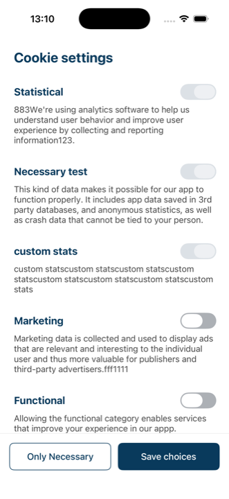
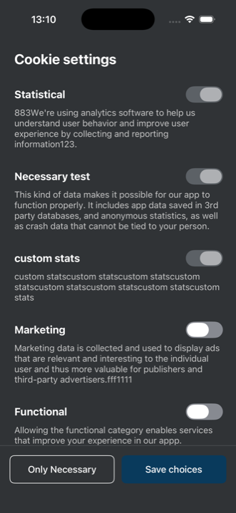

# Custom consent screen (example)

A fully custom cookie consent screen built on the **MobileConsentsSDK**. All reusable
code lives in this folder — the SDK keeps handling networking, caching, offline retry
and consent storage; these files provide only the UI.

The design:

- action buttons pinned to the bottom of the screen,
- categories separated by 32pt of vertical spacing instead of divider lines,
- brand blue (`#093A5C`) for the primary button and selected toggles,
- dark mode limited to black, white and grey tones (accent stays brand blue).

The screen comes in three variants rendering the same design — pick the one that
matches your app's UI stack:

| Variant | Files to copy | Minimum iOS |
|---|---|---|
| **UIKit** | `CustomConsentViewController.swift` + `ConsentColors.swift` | 12 |
| **SwiftUI** | `SwiftUI/CustomConsentView.swift` + `SwiftUI/CustomConsentSwiftUIController.swift` + `ConsentColors.swift` | 15 |
| **Standalone SwiftUI** | `Standalone/StandaloneConsentView.swift` + `Standalone/ConsentStore.swift` + `ConsentColors.swift` | 15 |

The UIKit and SwiftUI variants plug into the SDK's `customViewType` hook — the SDK
presents and dismisses the screen and reports the result through its completion
closures (the SwiftUI variant is hosted in a thin `UIViewController` wrapper for that
purpose). Use one of these unless you have a hard requirement to avoid UIKit.

The **standalone** variant involves no UIKit at all: it talks to the SDK's low-level
API (`fetchConsentSolution` / `postConsent`) and your app presents it itself, e.g.
with `.fullScreenCover`. The trade-off: the SDK does not expose the stored solution
version, so this variant cannot fully replicate `showPrivacyPopUpIfNeeded` — it can
only check whether any consents are saved (`store.hasSavedConsents`), and it will not
re-prompt users after the solution changes in the dashboard. Usage example is in the
`StandaloneConsentView` documentation comment.

## Setup

1. Add the MobileConsentsSDK to your app (Swift Package Manager or CocoaPods, see the
   main [README](../../README.md)).
2. Copy the files of your chosen variant (see table above) into your project.
3. Pass the class to the SDK when showing the popup:

   ```swift
   let mobileConsents = MobileConsents(
       clientID: "YOUR_CLIENT_ID",
       clientSecret: "YOUR_CLIENT_SECRET",
       solutionId: "YOUR_SOLUTION_ID"
   )

   // Always show the screen (SwiftUI: pass CustomConsentSwiftUIController.self instead):
   mobileConsents.showPrivacyPopUp(customViewType: CustomConsentViewController.self) { consents in
       consents.forEach { print("\($0.purpose): \($0.isSelected)") }
   } errorHandler: { error in
       print(error.localizedDescription)
   }

   // Or show it only when the user has not responded to the latest solution:
   mobileConsents.showPrivacyPopUpIfNeeded(customViewType: CustomConsentViewController.self) { consents in
       // called with the saved consents whether or not the screen was shown
   }
   ```

The completion closure receives the user's saved consents once the screen closes.
`MobileConsents.removeStoredConsents()` clears locally stored consent data.

## Screenshots

| Light | Dark |
|---|---|
|  |  |

## Consent screen buttons

| Button | What it does |
|---|---|
| **Only Necessary** | Accepts the required categories, rejects every optional one regardless of the toggles, then saves. |
| **Save choices** | Saves exactly what the user toggled (required categories stay on). |

Required categories (for example *Necessary*) are shown on and greyed out. They cannot
be turned off.

## Where to change things

| Change | Where |
|---|---|
| Brand color, light and dark palette (all variants) | `ConsentColors.swift` |
| Screen text (title, button labels) | `Strings` enum in the variant's view file |
| Spacing, corner radius, button height | `Layout` enum in `CustomConsentViewController.swift`; inline modifiers in the SwiftUI views |
| Screen layout | The variant's view file |

## Trying it in the example app

Run the `Example` scheme, tap the button in the top bar and pick **Brand custom UI**
(UIKit), **Brand custom UI (SwiftUI)** or **Brand custom UI (pure SwiftUI)** — the
first two present the screen through `showPrivacyPopUp(customViewType:)`, the third
through the standalone store. Switch the simulator to dark mode (⇧⌘A) to preview the
dark palette.
