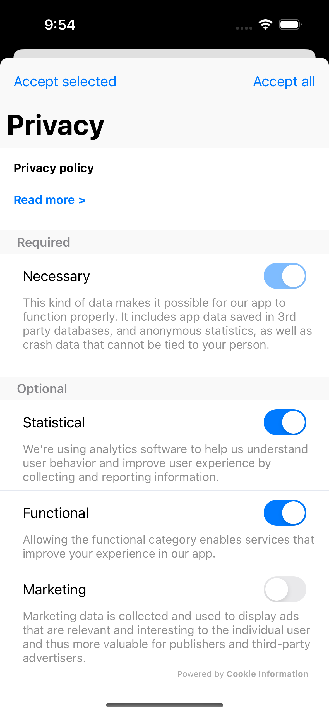
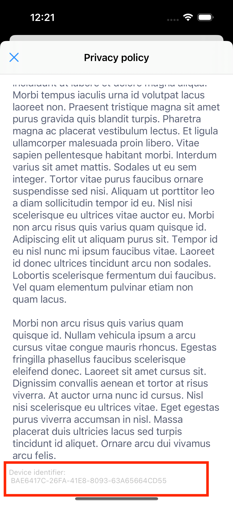
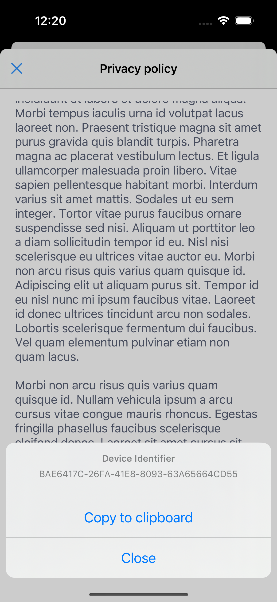

# Mobile Consents SDK

## Installation
### Swift Package Manager
MobileConsentsSDK is available through the Swift Package Manager (SPM) and CocoaPods. For the best experience we recommend using SPM by adding a new Package Dependency to your XCode project with the following repository URL:
```
https://github.com/cookie-information/ios-release
```

### Cocoapods
 Add the following line to your Podfile and run `pod install` from your terminal.
 ```
   pod 'MobileConsentsSDK', :git => 'https://github.com/cookie-information/ios-release.git'
 
 ```

### Manual installation

In you're unable to use SPM or CocoaPods in your project, you can add the source code to your project either as a Git submodule or manually copy it into your Xcode Workspace. Using the manual method is discouraged as it requires you to manually update the SDK when security or feature updates are released.
# Using the SDK

## Initializing
### Swift
```swift 
import MobileConsentsSDK

let mobileConsentsSDK = MobileConsents(clientID: "<CLIENT_ID>",
                                                  clientSecret: "<CLIENT_SECRET>",
                                                  solutionId: "<SOLUTION ID>"
                                      )
```

### Objective-C
```objc
@import MobileConsentsSDK;

MobileConsents *mobileConsents = [[MobileConsents alloc] initWithUiLanguageCode:@"EN"
                                                                clientID:@"<CLIENT_ID>"
                                                            clientSecret:@"<CLIENT_SECRET>"
                                                              solutionId:@"<SOLUTION ID>"
                                                             accentColor: UIColor.systemBlueColor
                                                                 fontSet: FontSet.standard
                                                                  enableNetworkLogger: YES];
```

# Using built-in mobile consents UI

SDK contains built-in screens for managing consents.
By default, built-in UI tries to use application's current langauge for consent translations.
If application's language is not available in translations, English will be used.

## Privacy Pop-Up



To show the Privacy Pop Up screen, use either `showPrivacyPopUp` (typically used in settings to allow for modification of the consent) or  `showPrivacyPopUpIfNeeded` (typically used at startup to present the privacy screen conditionally. See more below) method:

```swift
mobileConsentsSDK.showPrivacyPopUp() { settings in
            settings.forEach { consent in
                switch consent.purpose {
                case .statistical: break
                case .functional: break
                case .marketing: break
                case .necessary: break
                case .custom:
                    if consent.purposeDescription.lowercased() == "age consent" {
                        // handle user defined consent items such as age consent
                    }
                    if consent.consentItem.id == "<UUID of consent item comes here>" {
                      // handle user defined consent items such as age consent based on UUID
                    }

                @unknown default:
                    break
                }
                print("Consent given for:\(consent.purpose): \(consent.isSelected)")
            }
        }
```

The above function takes an optional completion block argument that should be used to react to the users consent and start or block various third-party SDKs.

By default, the pop up is presented by top view controller of key window of the application.
To change that, you can pass presenting view controller as an optional parameter.

### Presenting the privacy pop-up conditionally

The `showPrivacyPopUpIfNeeded` method is typically used to present the popup after app start (or at a point the developer deems appropriate). The method checks if a valid consent is already saved on the device and also checks if there are any updates on the Cookie Information server. In case there is no consent saved or the consent version is different from the one available on the server, the popup will be presented, otherwise only the completion closure is called. Using the `ignoreVersionChanges` parameter allows the developer to turn off the version checking mechanism and ignore consent version changes coming from the server.

```swift
        mobileConsentsSDK.showPrivacyPopUpIfNeeded(ignoreVersionChanges: true) { settings in
         // handle results here
        }
```


### Objective-C

Just like in Swift, the same methods are used to display the privacy pop-up, only with a slight variation to reflect Objective-C naming conventions. 

```Objective-C
       [self.mobileConsents showPrivacyPopUpIfNeededOnViewController:self
                                                         animated:YES
                                             ignoreVersionChanges:NO
                                                       completion:^(NSArray<UserConsent *> * _Nonnull) {
        // Handle consents here
    }];
```

### Handling errors

Both the `showPrivacyPopUp` and `showPrivacyPopUpIfNeeded` can be passed a `errorHandler` closure that is called when an error occurs. After the `errorHandler` is called, the popup is dismissed by the router, the selection made by the user is persisted locally and an attempt is made the next time `showPrivacyPopUpIfNeeded` is called or if `synchronizeIfNeeded` method is called manually.

```swift
        mobileConsentsSDK.showPrivacyPopUpIfNeeded(ignoreVersionChanges: true) { settings in
         // handle results here
        } errorHandler: { err in
            // handle the error here
        }
```

## Styling

The UI accent color and the fonts can be customized in the SDKs initializer:

```swift 
MobileConsents( clientID: "<CLIENT_ID>",
                clientSecret: "<CLIENT_SECRET>",
                solutionId: "<SOLUTION ID>"
                accentColor: .systemGreen,
                fontSet: FontSet(largeTitle: .boldSystemFont(ofSize: 34),
                                  body: .monospacedSystemFont(ofSize: 14, weight: .regular),
                                  bold: .monospacedSystemFont(ofSize: 14, weight: .bold))
                                                                )
```

Consent solution description and consent item texts can leverage HTML tags for basic text styling. Supported tags include:
- `<b>` for bolding text
- `<i>` and `<em>` for emphasizing text
- `<br>` for line breaking
- `<ul>` and `<li>` for creating lists
- `<a href>` for embeding links

Basic inline css are also supported, e.g. `<span style=\"color:red\">Text with custom color</span>`

## UI language

By default, Privacy Pop-up and Privacy Center use application's current langauge for consent translations. If application's language is not available in consent translations, English is used.

You can override langauge used by the screens by initializing SDK with custom langauge code. See the example app for more details.

## Building your custom UI

In case the built-in popup screen is too limiting for you, you can choose to build your own custom screen, while still using the data and communication built into the SDK.

To start you need to create a new class inheriting from `UIViewController` and conforming to `PrivacyPopupProtocol`. This protocol requires that you implement an initializer that takes a `viewModel` argument. This viewModel is passed in by the SDK and contains the data and methods necessary to display and save consents.

After setting up your UI components and constraints you should set up the viewModel callback functions: 
- `onDataLoaded: ((PrivacyPopUpData) -> Void)?` - which allows you to receive the data and configure the UI components. It is useful to keep a reference to the viewModel, because it contains functions to modify the state of the consent (consent given, or revoked), to save the consent, reject optional, or accept selection.
- `onError: ((ErrorAlertModel) -> Void)?` - to receive notifications about errors
- `onLoadingChange: ((Bool) -> Void)?` - to receive notifications about changes in the loading state (useful if you're using a spinner or similar progress indicator)

```swift
private func setupViewModel() {
  viewModel.onDataLoaded = { [weak self] data in
    guard let self = self else { return }
    self.titleLabel.text = data.title
    self.data = data
    self.table.reloadData()
  }
  viewModel.viewDidLoad()
}
```

To allow for the user to interact with the consent screen you'll need buttons that accept or reject the data collection/processing categories. In order to do so you'll need to create the buttons and make them call `viewModel.acceptAll`, `viewModel.acceptSelected` or `viewModel.rejectAll`. 

Once you're ready with the view controller, you should use the `showPrivacyPopUp` or `showPrivacyPopUpIfNeeded` methods with the customViewType argument: 

```swift
mobileConsentsSDK.showPrivacyPopUp(customViewType: CustomController.self) { settings in
  settings.forEach { consent in
    switch consent.purpose {
    case .statistical: break
    case .functional: break
    case .marketing: break
    case .necessary: break
    case .custom:
    if consent.purposeDescription.lowercased() == "age consent" {
    // handle user defined consent items such as age consent based on the name
    }
    if consent.consentItem.id == "<UUID of consent item comes here>" {
    // handle user defined consent items such as age consent based on UUID
    }
   } 
 }
}

```

To see a more complete implementation, please refer to the Example app and look for `CustomPopup.swift`
## Sending Consent to server manually

If you want to send consent to the server, first you have to create `Consent` object which structure looks like this:
```swift
var consent = Consent(consentSolutionId: "consentSolution.id", consentSolutionVersionId: "consentSolution.versionId")

/* if you want your consent to have a custom data you can add it as a last parametr */
let customData = ["email": "test@test.com", "device_id": "test_device_id"]
var consent = Consent(consentSolutionId: "consentSolution.id", consentSolutionVersionId: "consentSolution.versionId" customData: customData)

```
Then you have to add processing purposes which contains a given consents

```swift
/* given consents are included in main consent object as ProcessingPurpose objects which you can add to Consent object using `addProcessingPurpose` function */

let purpose = ProcessingPurpose(consentItemId: "consentItem.id", consentGiven: {true / false}, language: "en")
consent.addProcessingPurpose(purpose)

```
After setting up the Consent object you are ready to send it to the server
```swift
mobileConsentsSDK.postConsent(consent) { error in
  /* if error is nil it means that post succeeded */
}
```

## Getting locally saved consents data
```swift
let savedData:[SavedConsent] = mobileConsentsSDK.getSavedConsents()
```
SavedConsent object structure
```swift
struct  SavedConsent {
  let  consentItemId: String
  let  consentGiven: Bool
}
```

## Canceling last post to server request
```swift
mobileConsentsSDK.cancel()
```

## Logging

The SDK can be configured to print the network events in the console. These events include all network requests, responses and errors. By default this option is disabled to keep the unnecessary clutter out of the console, however in case of unexpected behaviour or to verify that everything works as expected it can be switched on in the SDK initializer.

```swift 
import MobileConsentsSDK

let mobileConsentsSDK = MobileConsents(clientID: "<CLIENT_ID>",
clientSecret: "<CLIENT_SECRET>",
solutionId: "<SOLUTION ID>",
enableNetworkLogger: true
)
```
## Displaying the device identifier
All consents sent to the Cookie Information servers are identified by a unique device identifier that is generated randomly after opening the privacy popup for the first time. This ID is necessary for Cookie Information to retrieve consents saved by the end user. 

During normal operation the identifier is not required, however in case the end user wants to access their saved consents, it is only possible if they provide the above mentioned identifier. When using the default user interface, the device identifier can be located at the bottom of the privacy policy page (after tapping "read more"). It can be copied to the clipboard by tapping the text and selecting the appropriate button from the action sheet.




