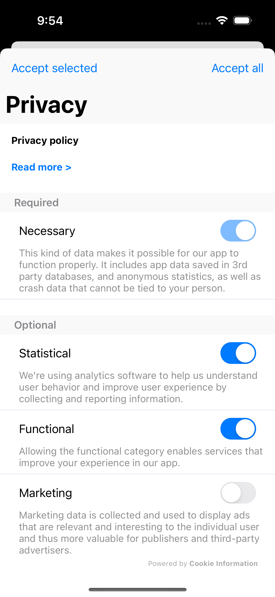
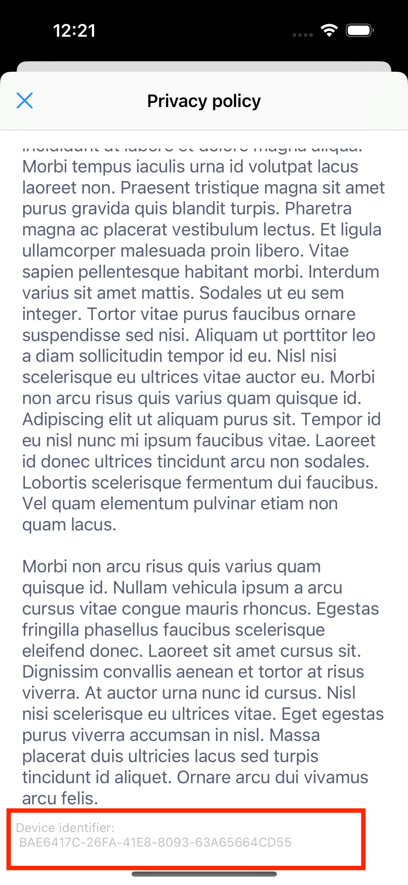
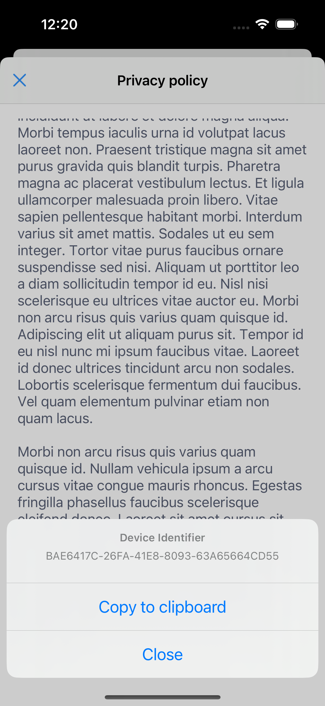

# Mobile Consents SDK

## Requirements
- iOS 15.0 or newer
- Swift 6.2 or newer (Xcode 26+)

> **Note:** Version 1.6.0 raises the minimum supported iOS version to 15.0. If your app needs to support older iOS versions, stay on version 1.5.9.

When upgrading from 1.x, see [Migrating from 1.x to 2.0](MIGRATION.md).

## Installation
### Swift Package Manager
MobileConsentsSDK is available through the Swift Package Manager (SPM) and CocoaPods. For the best experience we recommend using SPM by adding a new Package Dependency to your XCode project with the following repository URL:
```
https://github.com/cookie-information/ios-release
```

### Cocoapods
 Add the following line to your Podfile and run `pod install` from your terminal.
 ```
   pod 'MobileConsentsSDK', :git => 'https://github.com/cookie-information/ios-release.git'
 
 ```

### Manual installation

In you're unable to use SPM or CocoaPods in your project, you can add the source code to your project either as a Git submodule or manually copy it into your Xcode Workspace. Using the manual method is discouraged as it requires you to manually update the SDK when security or feature updates are released.
# Using the SDK

## Initializing
### Swift
```swift 
import MobileConsentsSDK

let mobileConsentsSDK = MobileConsents(clientID: "<CLIENT_ID>",
                                                  clientSecret: "<CLIENT_SECRET>",
                                                  solutionId: "<SOLUTION ID>"
                                      )
```

### Objective-C
```objc
@import MobileConsentsSDK;

MobileConsents *mobileConsents = [[MobileConsents alloc] initWithUiLanguageCode:@"EN"
                                                                clientID:@"<CLIENT_ID>"
                                                            clientSecret:@"<CLIENT_SECRET>"
                                                              solutionId:@"<SOLUTION ID>"
                                                             accentColor: UIColor.systemBlueColor
                                                                 fontSet: FontSet.standard
                                                    localizationOverride: @{}
                                                     networkLoggingMode: NetworkLoggingModeRedactedRequestsAndResponses];
```

# Using built-in mobile consents UI

SDK contains built-in screens for managing consents.
By default, built-in UI tries to use application's current langauge for consent translations.
If application's language is not available in translations, English will be used.

## Privacy Pop-Up



To show the Privacy Pop Up screen, use either `showPrivacyPopUp` (typically used in settings to allow for modification of the consent) or  `showPrivacyPopUpIfNeeded` (typically used at startup to present the privacy screen conditionally. See more below) method:

Callback API:

```swift
mobileConsentsSDK.showPrivacyPopUp() { settings in
    settings.forEach { consent in
        switch consent.purpose {
        case .statistical: break
        case .functional: break
        case .marketing: break
        case .necessary: break
        case .custom:
            if consent.purposeDescription.lowercased() == "age consent" {
                // Handle a user-defined consent item by name.
            }
            if consent.consentItem.id == "<CONSENT_ITEM_ID>" {
                // Handle a user-defined consent item by identifier.
            }
        @unknown default:
            break
        }
        print("Consent given for: \(consent.purpose): \(consent.isSelected)")
    }
} errorHandler: { error in
    print("Failed to show the privacy pop-up: \(error.localizedDescription)")
}
```

Async/await API:

```swift
do {
    let settings = try await mobileConsentsSDK.showPrivacyPopUp()
    settings.forEach { consent in
        print("Consent given for: \(consent.purpose): \(consent.isSelected)")
    }
} catch {
    print("Failed to show the privacy pop-up: \(error.localizedDescription)")
}
```

The completion block runs after the selection is stored locally, before the popup dismissal starts. Use it to start or block third-party SDKs.

By default, the pop up is presented by top view controller of key window of the application.
To change that, you can pass presenting view controller as an optional parameter.

The unconditional popup is presented before the SDK fetches and caches the consent solution. If fetching or caching fails, the SDK calls the error handler and dismisses the popup.

### Presenting the privacy pop-up conditionally

The `showPrivacyPopUpIfNeeded` method is typically used to present the popup after app start (or at a point the developer deems appropriate). It always fetches and caches the consent solution before checking whether a nonempty consent set is saved on the device and whether its solution version matches the fetched version. If fetching or caching fails, it calls the error handler and does not make a presentation decision. If the stored consent set is empty or the consent version differs, the popup is presented; otherwise only the completion closure is called. Using the `ignoreVersionChanges` parameter allows the developer to turn off version checking and ignore consent version changes from the server.

Callback API:

```swift
mobileConsentsSDK.showPrivacyPopUpIfNeeded(ignoreVersionChanges: true) { settings in
    settings.forEach { consent in
        print("Consent given for: \(consent.purpose): \(consent.isSelected)")
    }
} errorHandler: { error in
    print("Failed to resolve the privacy pop-up: \(error.localizedDescription)")
}
```

Async/await API:

```swift
do {
    let settings = try await mobileConsentsSDK.showPrivacyPopUpIfNeeded()
    settings.forEach { consent in
        print("Consent given for: \(consent.purpose): \(consent.isSelected)")
    }
} catch {
    print("Failed to resolve the privacy pop-up: \(error.localizedDescription)")
}
```


### Objective-C

Just like in Swift, the same methods are used to display the privacy pop-up, only with a slight variation to reflect Objective-C naming conventions. 

```Objective-C
    [self.mobileConsents showPrivacyPopUpIfNeededWithCustomViewType:nil
                                                   onViewController:self
                                                           animated:YES
                                               ignoreVersionChanges:NO
                                                         completion:^(NSArray<UserConsent *> * _Nonnull consents) {
        // Handle consents here
    }
                                                       errorHandler:^(NSError * _Nonnull error) {
        // Handle the error here
    }];
```

### Handling errors

Both `showPrivacyPopUp` and `showPrivacyPopUpIfNeeded` require a completion closure and an `errorHandler` closure. The error handler reports consent-solution fetch, presentation, submission creation, and local-persistence errors. It does not report background upload failures.

After the user accepts or rejects the selection, the SDK verifies the local write and calls the completion block before starting the popup dismissal. If the local write fails, it calls the error handler instead.

If an upload fails, the consent decision remains stored locally and the SDK retries it automatically. You can also call `synchronizeIfNeeded()` to request a retry.

## Styling

The UI accent color and the fonts can be customized in the SDKs initializer:

```swift 
MobileConsents( clientID: "<CLIENT_ID>",
                clientSecret: "<CLIENT_SECRET>",
                solutionId: "<SOLUTION ID>"
                accentColor: .systemGreen,
                fontSet: FontSet(largeTitle: .boldSystemFont(ofSize: 34),
                                  body: .monospacedSystemFont(ofSize: 14, weight: .regular),
                                  bold: .monospacedSystemFont(ofSize: 14, weight: .bold))
                                                                )
```

Consent solution description and consent item texts can leverage HTML tags for basic text styling. Supported tags include:
- `<b>` for bolding text
- `<i>` and `<em>` for emphasizing text
- `<br>` for line breaking
- `<ul>` and `<li>` for creating lists
- `<a href>` for embeding links

Basic inline css are also supported, e.g. `<span style=\"color:red\">Text with custom color</span>`

## UI language

By default, Privacy Pop-up and Privacy Center use application's current langauge for consent translations. If application's language is not available in consent translations, English is used.

You can override langauge used by the screens by initializing SDK with custom langauge code. See the example app for more details.

## Building your custom UI

In case the built-in popup screen is too limiting for you, you can choose to build your own custom screen, while still using the data and communication built into the SDK.

To start you need to create a new class inheriting from `UIViewController` and conforming to `PrivacyPopupProtocol`. This protocol requires that you implement an initializer that takes a `viewModel` argument. This viewModel is passed in by the SDK and contains the data and methods necessary to display and save consents.

After setting up your UI components and constraints you should set up the viewModel callback functions: 
- `onDataLoaded: ((PrivacyPopUpData) -> Void)?` - which allows you to receive the data and configure the UI components. It is useful to keep a reference to the viewModel, because it contains functions to modify the state of the consent (consent given, or revoked), to save the consent, reject optional, or accept selection.
- `onLoadingChange: ((Bool) -> Void)?` - to receive notifications about changes in the loading state (useful if you're using a spinner or similar progress indicator)

```swift
private func setupViewModel() {
  viewModel.onDataLoaded = { [weak self] data in
    guard let self = self else { return }
    self.titleLabel.text = data.title
    self.data = data
    self.table.reloadData()
  }
  viewModel.viewDidLoad()
}
```

To allow for the user to interact with the consent screen you'll need buttons that accept or reject the data collection/processing categories. In order to do so you'll need to create the buttons and make them call `viewModel.acceptAll`, `viewModel.acceptSelected` or `viewModel.rejectAll`. 

Once you're ready with the view controller, you should use the `showPrivacyPopUp` or `showPrivacyPopUpIfNeeded` methods with the customViewType argument: 

```swift
mobileConsentsSDK.showPrivacyPopUp(customViewType: CustomController.self) { settings in
  settings.forEach { consent in
    switch consent.purpose {
    case .statistical: break
    case .functional: break
    case .marketing: break
    case .necessary: break
    case .custom:
    if consent.purposeDescription.lowercased() == "age consent" {
    // handle user defined consent items such as age consent based on the name
    }
    if consent.consentItem.id == "<UUID of consent item comes here>" {
    // handle user defined consent items such as age consent based on UUID
    }
   } 
 }
}

```

To see a more complete implementation, please refer to the Example app and look for `CustomPopup.swift`

## Fetching the consent solution manually

Use the callback API:

```swift
mobileConsentsSDK.fetchConsentSolution { result in
    switch result {
    case .success(let solution):
        print("Loaded consent solution: \(solution.id)")
    case .failure(let error):
        print("Failed to load the consent solution: \(error.localizedDescription)")
    }
}
```

Or use async/await:

```swift
do {
    let solution = try await mobileConsentsSDK.fetchConsentSolution()
    print("Loaded consent solution: \(solution.id)")
} catch {
    print("Failed to load the consent solution: \(error.localizedDescription)")
}
```

## Saving consent manually

Create a `Consent` value with the current submitted decision:
```swift
let customData = ["email": "test@test.com", "device_id": "test_device_id"]
var consent = Consent(
  consentSolutionId: "consentSolution.id",
  consentSolutionVersionId: "consentSolution.versionId",
  customData: customData,
  userConsents: []
)

```
Add processing purposes when you do not provide `userConsents`:

```swift
let purpose = ProcessingPurpose(
  consentItemId: "consentItem.id",
  consentGiven: true,
  language: "en"
)
consent.addProcessingPurpose(purpose)

```
The callback reports whether verified local persistence succeeded. A successful callback does not mean the server upload has finished.

```swift
mobileConsentsSDK.postConsent(consent) { error in
  guard error == nil else {
    // Handle a local-persistence error.
    return
  }
  // The submitted decision is stored locally. Pending decisions synchronize independently.
}
```

The async API has the same semantics:

```swift
do {
    try await mobileConsentsSDK.postConsent(consent)
    print("The consent was stored locally.")
} catch {
    print("Failed to store the consent: \(error.localizedDescription)")
}
```

## Getting locally saved consents data

The synchronous compatibility API returns an empty array when the local store cannot be read:

```swift
let savedData = mobileConsentsSDK.getSavedConsents()
```

The async API reports read errors:

```swift
do {
    let savedData = try await mobileConsentsSDK.loadSavedConsents()
    print("Loaded \(savedData.count) saved consents.")
} catch {
    print("Failed to load saved consents: \(error.localizedDescription)")
}
```

The synchronous compatibility property returns an empty string when the local store cannot be read:

```swift
let userID = mobileConsentsSDK.userId
```

The async API reports read errors:

```swift
do {
    let userID = try await mobileConsentsSDK.getUserId()
    print("User identifier: \(userID)")
} catch {
    print("Failed to load the user identifier: \(error.localizedDescription)")
}
```

The synchronous compatibility API ignores local-persistence errors:

```swift
mobileConsentsSDK.removeStoredConsents()
```

The async API confirms local removal and reports persistence errors:

```swift
do {
    try await mobileConsentsSDK.clearStoredConsents()
    print("Stored consents were removed.")
} catch {
    print("Failed to remove stored consents: \(error.localizedDescription)")
}
```

Objective-C imports the async methods as `loadSavedConsentsWithCompletionHandler:`, `getUserIdWithCompletionHandler:`, and `removeStoredConsentsWithCompletionHandler:`. The synchronous `userId`, `getSavedConsents()`, and `removeStoredConsents()` APIs remain available.

## Synchronizing pending consent

Use the fire-and-forget API when you do not need the result:

```swift
mobileConsentsSDK.synchronizeIfNeeded()
```

Use async/await to check whether a pending consent remains after the attempt:

```swift
let pendingRemains: Bool = await mobileConsentsSDK.synchronizeIfNeeded()
```

## Logging

Network logging uses Apple's unified logging system and is disabled by default.

- `metadata` records request methods, redacted URLs, response status codes, and request identifiers.
- `redactedRequestsAndResponses` additionally records sanitized headers and payload sizes. Query parameters, credentials, authorization values, cookies, and payload contents are not logged.
- `fullRequests` records complete request URLs, headers, and payloads, while responses remain limited to metadata.
- `fullRequestsAndResponses` records the complete network exchange.

The full logging modes may expose `clientSecret`, access tokens, consent choices, identifiers, and custom data. Enable them only for controlled diagnostics and never in production builds.

```swift 
import MobileConsentsSDK

let mobileConsentsSDK = MobileConsents(
    clientID: "<CLIENT_ID>",
    clientSecret: "<CLIENT_SECRET>",
    solutionId: "<SOLUTION ID>",
    networkLoggingMode: .redactedRequestsAndResponses
)
```
## Displaying the device identifier
All consents sent to the Cookie Information servers are identified by a unique device identifier that is generated randomly on first SDK access. This ID is necessary for Cookie Information to retrieve consents saved by the end user.

During normal operation the identifier is not required, however in case the end user wants to access their saved consents, it is only possible if they provide the above mentioned identifier. When using the default user interface, the device identifier can be located at the bottom of the privacy policy page (after tapping "read more"). It can be copied to the clipboard by tapping the text and selecting the appropriate button from the action sheet.



               
